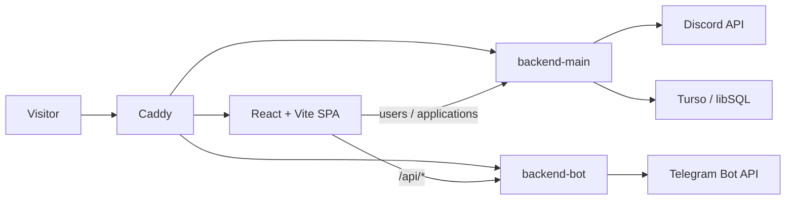
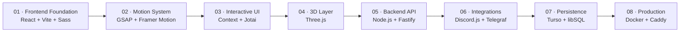

[README.md](https://github.com/user-attachments/files/32431714/README.md)
# SUXXESZ — Personal Portfolio & Full-Stack Web Project

[](https://github.com/suxxesz/core)
[](https://github.com/suxxesz/core/commits/main)
[](https://github.com/suxxesz/core/commits/main)
[](https://github.com/suxxesz/core)

[](https://react.dev/)
[](https://vite.dev/)
[](https://www.typescriptlang.org/)
[](https://sass-lang.com/)
[](https://gsap.com/)
[](https://motion.dev/)
[](https://jotai.org/)
[](https://threejs.org/)

[](https://nodejs.org/)
[](https://fastify.dev/)
[](https://discord.js.org/)
[](https://telegraf.js.org/)
[](https://turso.tech/)
[](https://www.docker.com/)
[](https://caddyserver.com/)

## Overview

`core` is a personal portfolio / interactive web project built as a small full-stack system.

The project combines an animated React frontend with a Node.js backend and external service integrations. The public interface contains an interactive personal page, audio player, animated UI, 3D/space visuals and a contact form. The backend handles API requests, Discord presence data, Telegram-based application processing and a Turso/libSQL database layer.

### Main features

- Interactive portfolio landing page
- Audio player with playlist and player popup
- GSAP and Framer Motion based UI animations
- Interactive space / galaxy visuals built around Three.js
- Contact form with validation/state handling
- Telegram workflow for receiving, accepting and rejecting applications
- Discord presence / last-seen widget
- Turso/libSQL database integration
- Docker Compose deployment with Caddy reverse proxy
- GitHub Pages frontend deployment

---

## Architecture



### Application layers

**Frontend**

React is responsible for the UI, page composition and interactive state. Vite handles development and production builds. Sass is used for styling, while GSAP, Framer Motion and Three.js provide motion and visual effects.

**Backend**

Fastify provides the HTTP API. TypeBox is used for request/config schemas, Fastify plugins organize infrastructure, and `tsx` executes the TypeScript server during development.

**Integrations**

Discord.js provides Discord presence data. Telegraf powers the Telegram workflow used for processing contact/application messages.

**Persistence**

The backend contains a Turso/libSQL client and creates an `applications` table for application data.

**Delivery**

The project contains Dockerfiles for both application layers and a Compose configuration that runs the backend services and Caddy. Caddy serves the SPA and proxies API routes.

---

## Tech Stack

### Frontend

| Technology | Version | Purpose |
|---|---:|---|
| React | `18.2.0` | UI library |
| Vite | `7.3.1` | Development server and build tool |
| TypeScript | source | Typed application code |
| Sass | `1.98.0` | SCSS styling |
| GSAP | `3.15.0` | High-control animations |
| Framer Motion | `12.40.0` | React animations |
| Jotai | `2.20.1` | Atomic state management |
| Three.js | `0.185.1` | 3D graphics |
| React Select | `5.10.2` | Select controls |
| Lucide React | `1.14.0` | Icons |
| `vite-plugin-svgr` | `4.5.0` | SVG → React components |
| `gh-pages` | `6.3.0` | GitHub Pages deployment |

### Backend

| Technology | Version | Purpose |
|---|---:|---|
| Node.js | `20` | Runtime / Docker base image |
| Fastify | `5.8.5` | HTTP API server |
| `@fastify/env` | `7.0.0` | Environment validation/config |
| `@fastify/cors` | `11.3.0` | CORS |
| TypeBox | `0.34.49` | JSON Schema / typing |
| Fastify Plugin | `6.0.0` | Plugin encapsulation |
| Discord.js | `14.26.4` | Discord gateway / presence |
| Telegraf | `4.16.3` | Telegram bot |
| `@libsql/client` | `0.17.4` | Turso/libSQL access |
| `tsx` | `4.19.0` | TypeScript execution |
| `dotenv` | `17.4.2` | Environment loading |
| Pino Pretty | `13.1.3` | Development log formatting |
| Nodemon | `3.1.14` | Development restart |

### Infrastructure

| Technology | Version / Image | Purpose |
|---|---:|---|
| Docker | — | Containerization |
| Docker Compose | — | Multi-container orchestration |
| Caddy | `2-alpine` | Static server + reverse proxy |
| GitHub Pages | — | Frontend deployment |

> **Note:** TypeScript is used throughout the source code, but the current `package.json` files do not pin a standalone `typescript` compiler version. Runtime TypeScript execution is handled through `tsx`.

---

## Project Structure

```text
core/
├── frontend/
│   ├── src/
│   │   ├── components/
│   │   ├── context/
│   │   ├── hooks/
│   │   ├── layouts/
│   │   ├── pages/
│   │   ├── providers/
│   │   └── types/
│   ├── Dockerfile
│   ├── Caddyfile
│   └── package.json
│
├── backend/
│   ├── server/
│   │   ├── src/
│   │   │   ├── discord/
│   │   │   ├── plugins/
│   │   │   └── routes/
│   │   └── bot/
│   │       └── core/
│   ├── Dockerfile
│   └── package.json
│
└── docker.compose.yml
```

---

## Getting Started

### 1. Clone the repository

```bash
git clone https://github.com/suxxesz/core.git
cd core
```

### 2. Install frontend dependencies

```bash
cd frontend
npm ci
```

Start the frontend:

```bash
npm run dev
```

### 3. Install backend dependencies

Open another terminal:

```bash
cd backend
npm ci
```

Create `backend/.env`:

```env
TOKEN=your_discord_bot_token
PORT=3001
GUILD_ID=your_discord_guild_id

TELEGRAM_BOT_TOKEN=your_telegram_bot_token
TELEGRAM_CHAT_ID=your_telegram_chat_id

TURSO_URL=your_turso_database_url
TURSO_AUTH_TOKEN=your_turso_auth_token
```

Start the backend:

```bash
npm run dev
```

The current backend development command runs the TypeScript server through `tsx`.

---

## API Surface

### Main backend

| Method | Route | Purpose |
|---|---|---|
| `GET` | `/health` | Health check |
| `GET` | `/users/:id` | Discord user / presence data |
| `*` | `/applications*` | Application-related routes |

### Telegram / form backend

| Method | Route | Purpose |
|---|---|---|
| `POST` | `/api/message` | Submit a form/application |
| `GET` | `/api/message/:sessionId` | Read current application session |
| `GET` | `/health` | Health check |

The Telegram flow currently supports:

```text
Form submission
      ↓
Create session
      ↓
Send Telegram notification
      ↓
Accept / Reject
      ↓
Optional response / rejection reason
      ↓
Update session state
```

---

## Database

The backend initializes a Turso/libSQL connection using:

```env
TURSO_URL=
TURSO_AUTH_TOKEN=
```

The current database bootstrap creates an `applications` table containing:

```text
id
discord_id
name
email
message
status
created_at
```

The current repository also uses an in-memory session store for the Telegram form workflow. This is a useful area for a future persistence refactor.

---

# Technology Roadmap

The roadmap is intentionally split into **implemented technology milestones** and **planned engineering upgrades**.

## Development path



### Milestones

| Stage | Technology | Status |
|---|---|---|
| 01 | React + Vite + Sass |  Implemented |
| 02 | GSAP + Framer Motion |  Implemented |
| 03 | React Context + Jotai |  Implemented |
| 04 | Three.js |  Implemented |
| 05 | Node.js + Fastify + TypeBox |  Implemented |
| 06 | Discord.js + Telegraf |  Implemented |
| 07 | Turso / libSQL |  Implemented |
| 08 | Docker + Caddy |  Implemented |
| 09 | Automated testing |  Planned |
| 10 | CI/CD with GitHub Actions |  Planned |
| 11 | Centralized validation / API contracts |  Planned |
| 12 | Persistent session/application workflow |  Planned |
| 13 | Monitoring and error tracking |  Planned |
| 14 | Production hardening / performance budget |  Planned |

> The historical roadmap groups commits by the technology introduced or the architectural capability delivered. It is intentionally more useful than a raw list of commit hashes, because the roadmap remains readable even when commits are squashed, rebased or reorganized.

---

## Engineering Roadmap

### Frontend

- [x] React + Vite foundation
- [x] Sass-based styling
- [x] GSAP animations
- [x] Framer Motion integration
- [x] Audio player
- [x] Context-based providers
- [x] Jotai integration
- [x] Three.js visual layer
- [ ] Add automated component tests
- [ ] Add E2E coverage
- [ ] Improve accessibility auditing
- [ ] Add performance budgets for 3D/animation-heavy pages

### Backend

- [x] Fastify API
- [x] Environment configuration
- [x] TypeBox schemas
- [x] Fastify plugins
- [x] Discord integration
- [x] Telegram integration
- [x] Turso/libSQL connection
- [x] Health endpoint
- [ ] Centralized error handling
- [ ] Stronger shared API types
- [ ] Persistent session storage
- [ ] API documentation
- [ ] Automated integration tests
- [ ] Structured production logging

### Infrastructure

- [x] Dockerfiles
- [x] Docker Compose
- [x] Caddy reverse proxy
- [x] SPA fallback
- [x] GitHub Pages deployment script
- [ ] GitHub Actions CI
- [ ] Automated deployment pipeline
- [ ] Health checks / readiness checks
- [ ] Production monitoring

---

## Deployment

### GitHub Pages

The frontend contains a deployment script:

```bash
cd frontend
npm run deploy
```

This builds the frontend and publishes `dist` to the `gh-pages` branch of this repository.

### Docker Compose

For a full containerized deployment:

```bash
docker compose -f docker.compose.yml up -d --build
```

The Compose setup contains:

```text
backend-main
backend-bot
caddy
```

Caddy serves the built SPA and routes API traffic to the appropriate backend service.

---

## Configuration

The backend currently expects these environment variables:

| Variable | Required | Description |
|---|:---:|---|
| `TOKEN` | ✅ | Discord bot token |
| `PORT` | ✅ | Backend HTTP port |
| `GUILD_ID` | ✅ | Discord guild identifier |
| `TELEGRAM_BOT_TOKEN` | ✅ | Telegram bot token |
| `TELEGRAM_CHAT_ID` | ✅ | Target Telegram chat |
| `TURSO_URL` | ✅ | Turso database URL |
| `TURSO_AUTH_TOKEN` | ✅ | Turso authentication token |

Never commit real credentials to the repository.

---

## Repository Links

- [Repository](https://github.com/suxxesz/core)
- [Frontend](https://github.com/suxxesz/core/tree/main/frontend)
- [Backend](https://github.com/suxxesz/core/tree/main/backend)
- [Docker Compose](https://github.com/suxxesz/core/blob/main/docker.compose.yml)
- [Commit history](https://github.com/suxxesz/core/commits/main)

---

## License

The backend package currently declares the `ISC` license. Add a root-level `LICENSE` file before presenting the repository as a single licensed project.
